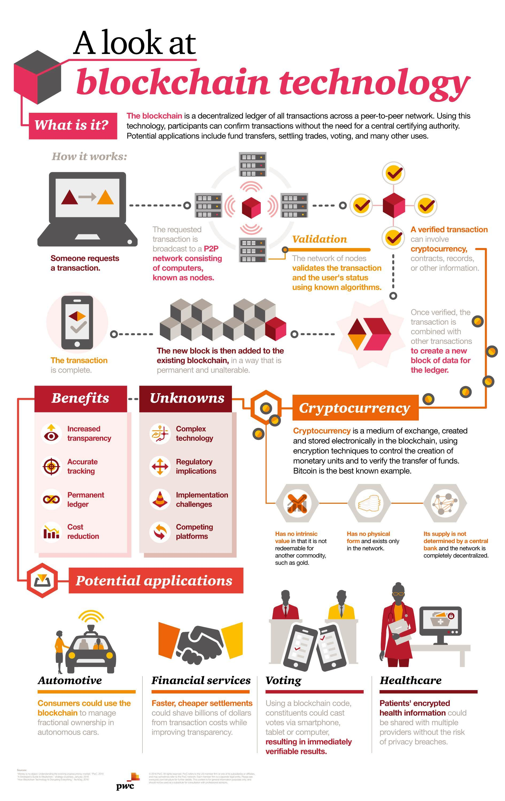

---
title: "How will Blockchain impact Data Science"
layout: post
use_code: true
---

Blockchain has established itself as the next emerging data processing
technology. Data scientists are starting to realize that blockchain holds a
number of advantages when it comes to data integrity. Blockchain assists greatly
in data science aspects such as: 
- Fostering data traceability
- Real-time analysis
- Generating trust
- Easy data sharing
- Improves data integrity
- Confirmed data quality

For a quick refresher on what blockchain is see the infographic below.











