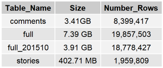
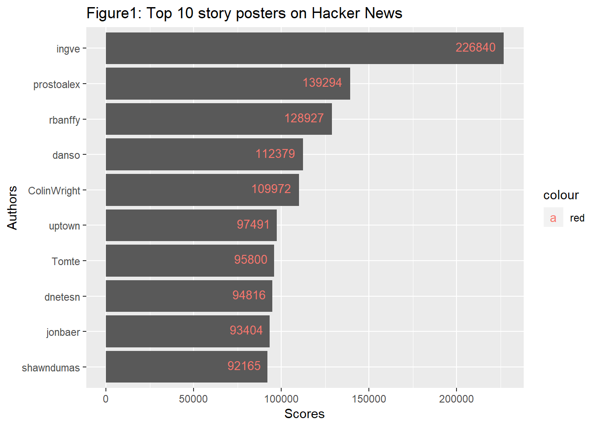
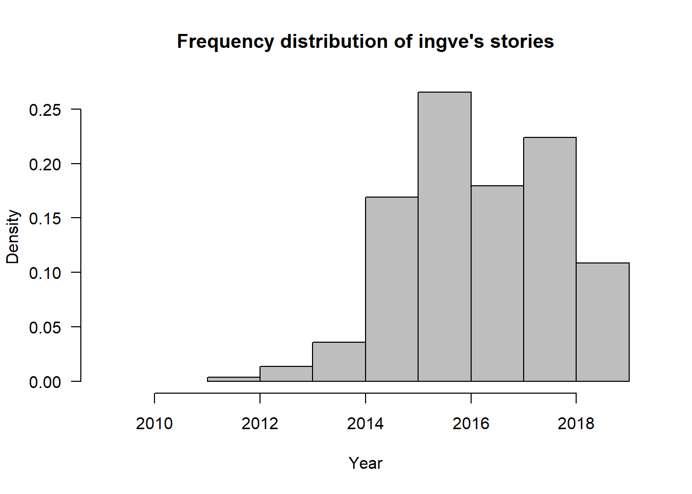
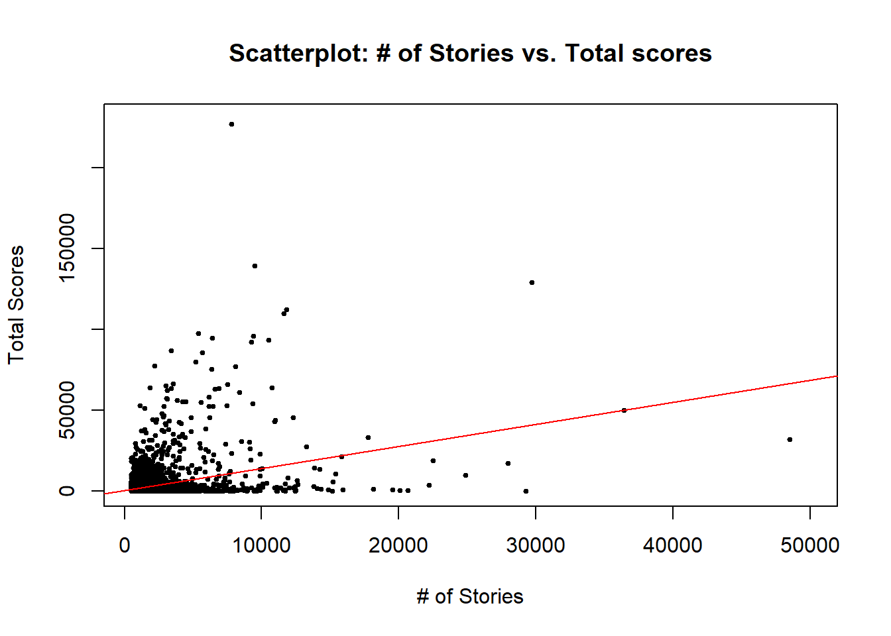
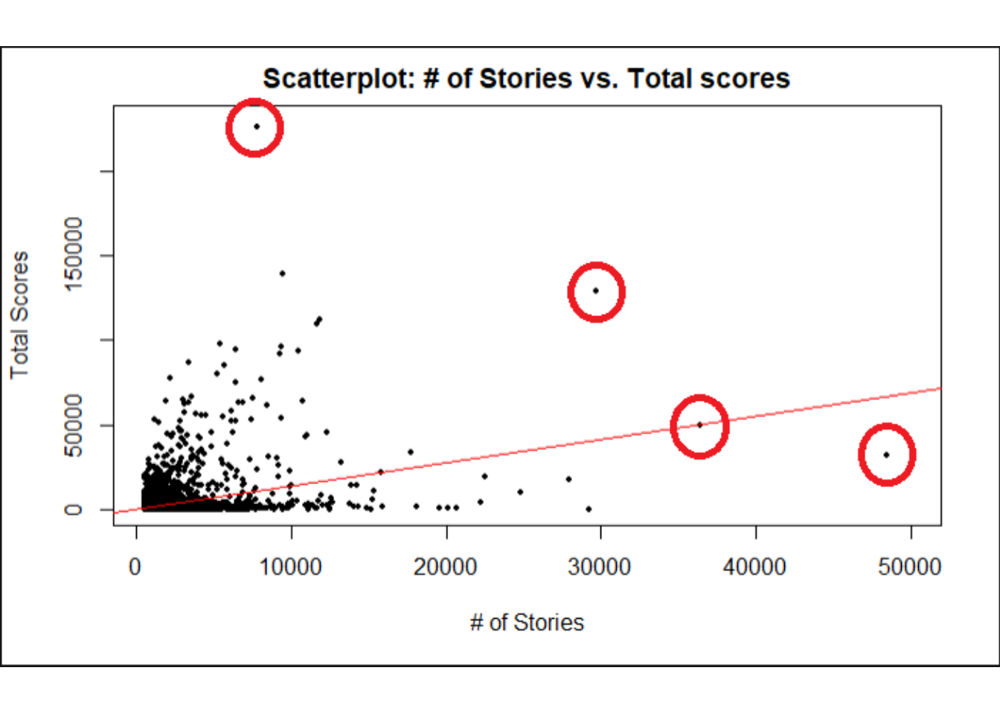
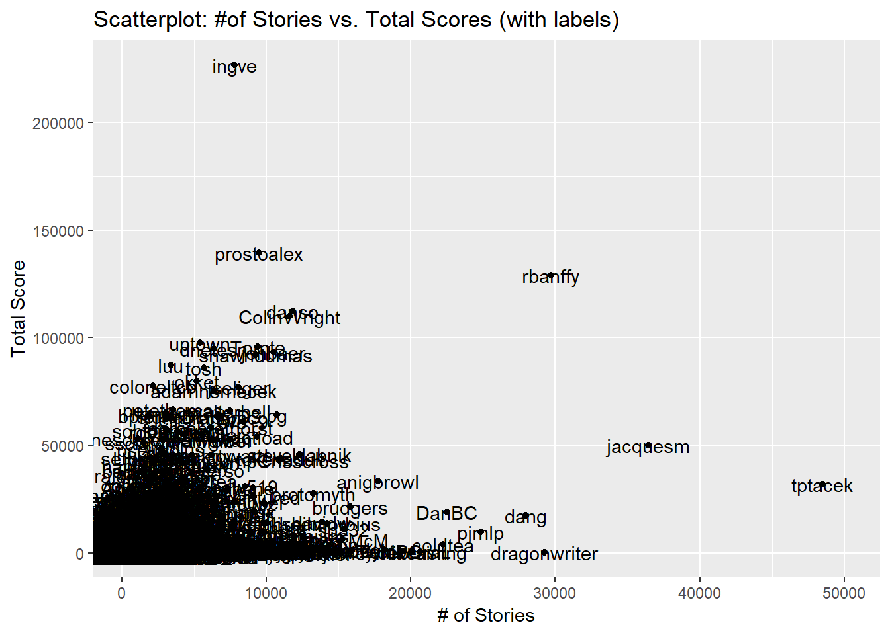
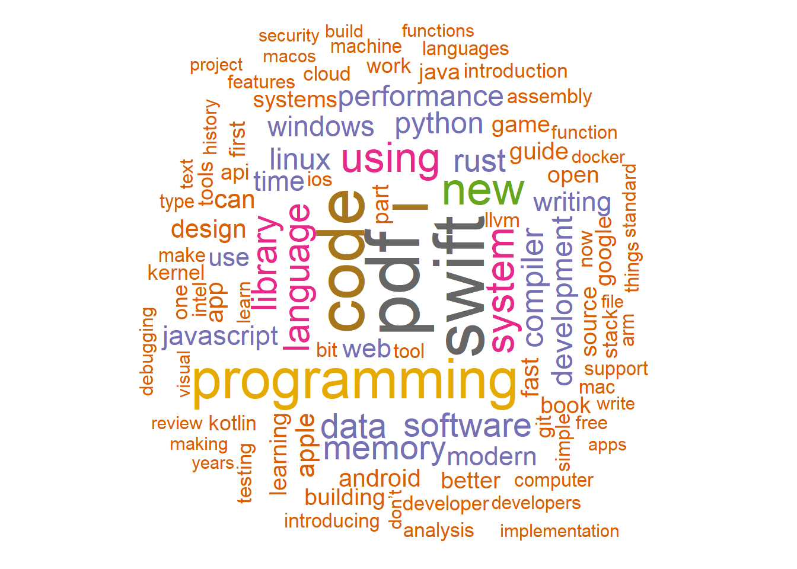

How to find a good news poster on HN
====================================

### Exploratory data analysis for the Hacker News forum

#### Hendrik A. Dreyer

#### 8 May 2019

Introduction
============

Hacker News is a social news website focusing on computer science and
entrepreneurship. It is run by Paul Graham’s investment fund and start up
incubator, Y Combinator. In general, content that can be submitted is defined as
“anything that gratifies one’s intellectual curiosity”  
My en devour with this EDA is to figure out who is the “top” news article (a.k.a
stories) poster on HN. HN has a sophisticated algorithm, which calculates scores
for posted stories. Surely, this means that some people have a knack for posting
more interesting stories than other. Let’s see if we can find them.

We’ll need the following R libraries for this EDA:

library(dplyr)

library(readr)

library(ggplot2)

library(httr)

library(data.table)

library(lubridate)

library(bigrquery)

YCombinator.com has released the contents of its online forum to Google. The
forum content is freely available as a public BigQuery data set as
[bigquery-public-data.hacker_news.](https://console.cloud.google.com/bigquery?p=bigquery-public-data&d=hacker_news).
There are 4 tables listed under the hacker_news entry:

For this EDA I will use the table labelled, “full” as it contains all posts to
HN since 2006.

As a first step I’ll interrogate Google BigQuery to find out who are the authors
with the highest scores.

sql \<- "SELECT sum(t.score) as high_scores, t.by

FROM [bigquery-public-data.hacker_news.full] as t

GROUP BY t.by

ORDER BY high_scores DESC

LIMIT 10"

\# Execute the query and store the result

\# project is the project id I created in my personal GCP account

\# query_exec is an api call from the bigrquery package, which calls directly
into Google BigQuery

todo_copies \<- query_exec(sql, project = project)

Plot the results.

ggplot(data = todo_copies, aes(x = reorder(t_by, high_scores), y = high_scores))
+

geom_bar(stat="identity") +

labs(x = "Authors", y = "Scores") +

ggtitle("Figure1: Top 10 story posters on Hacker News") +

coord_flip() +

geom_text(aes(label=high_scores, color = 'red'), vjust=0.3, hjust=1.2, size=3.5)

We can see that “ingve” is the clear leader in terms of accumulated scores on
all the stories that he/she posted. Let’s take a look at how active “ingve” was
during her/his years as prolific story poster.

sql \<- "SELECT YEAR(t.timestamp) as year_written

FROM [bigquery-public-data.hacker_news.full] as t

WHERE t.by = 'ingve'

ORDER BY year_written ASC"

\# Execute the query and store the result

todo_copies \<- query_exec(sql, project = project)

Let’s plot the frequency distribution of ingve’s post

hist(todo_copies\$year_written,

main="Frequency distribution of ingve's stories",

xlab="Year",

xlim=c(2009,2019),

border="black",

col="grey",

breaks=c(2011, 2012, 2013, 2014, 2015, 2016, 2017, 2018, 2019),

las=1,

prob = TRUE)

From the above histogram we can observe that ingve started out slow at the end
of 2010 and then steadily increased his/her activity right up until 2014 and
2015 and eventually he/she went into a “publishing” frenzy in 2016. Ingve took a
dip in 2017 only to bounch back in 2018.  
This is impressive, not to say the least. But, another questions comes to mind -
“Which metrics do we use to measure the quality of a story poster in HN?” Is it
the sheer number of points that a poster has racked up? Is it the number of
stories that he/she post? Is it the frequency with which a member post stories.
Or, maybe how large his/her following is? Surely, in my mind, it should be a
combination of these metrics through which we can determine the quality of a
user’s posted stories.

Let’s retrieve the count of stories by each author and list them by a quality
factor. The quality factor is determined as follows:

QF = Number_of_Points / Number_of_Stories

This will give us effectively the average number of points scored per story
posted. Take note: The scoring system on HN is a complex system and as such
implicitly includes the size of the poster’s following.

sql \<- "SELECT t.by,

count(t.by) as number_of_stories,

sum(t.score) as total_score,

sum(t.score)/count(t.by) as quality_factor

FROM [bigquery-public-data.hacker_news.full] as t

GROUP BY t.by

ORDER BY quality_factor DESC

LIMIT 10"

\# Execute the query and store the result

todo_copies \<- query_exec(sql, project = project)

todo_copies

\#\# t_by number_of_stories total_score quality_factor

\#\# 1 fejkp 1 2585 2585

\#\# 2 daveowei 1 1652 1652

\#\# 3 yossorion 1 1382 1382

\#\# 4 timebomb0 1 1320 1320

\#\# 5 nieksa 1 1239 1239

\#\# 6 afraidofadria 1 1125 1125

\#\# 7 rattt 1 1061 1061

\#\# 8 technocracy 1 996 996

\#\# 9 throwawaygoaway 1 911 911

\#\# 10 hohaa 1 845 845

From the above listed table we can see that the author named, “fejkp” managed to
score 2585 points for only 1 post. That post is titled, “Linus Torvalds
apologizes for his behavior, takes time off”. And, rightfully so …  
The list above is a bit dissatisfying because, as impressed as I am with a
poster that gets that many points for a single post, I would rather look at
posters who have a larger number of posts. So, instead I’m looking for not only
quality (as judged by the peers on HN) but, also quantity. I don’t think
Shakespeare would have become the literary giant he is today if he only “posted”
The Tempest. I hate Caliban, he’s a tool. So, how do we determine the optimal
quality factor that would embody our mystery poster of both quality and
quantity?  
Let’s do a scatter plot of the total scores against the number of stories for
all the posters. Maybe we can spot some outliers.

plot(todo_copies\$number_of_stories,

todo_copies\$total_score, main="Scatterplot: \# of Stories vs. Total scores",

xlab="\# of Stories",

ylab="Total Scores",

xlim=c(500, 50000),

ylim=c(0, 230000),

pch=19,

cex=.5)

abline(lm(todo_copies\$total_score\~todo_copies\$number_of_stories), col="red")
\# regression line (y\~x)

From the above scatter plot we can see a linear relationship between the number
of stories posted vs. the accumulated total score racked up for all the stories
posted (red line). This was to be expected - more stories equal more
opportunities to rack up points.

In the above plot I have circled 4 outliers with red. Clearly these posters
stand out in terms of quantity as well as total scores. Let’s overlay these
points with usernames in order to identify our four outlier posters.

Our four outlier posters are ingve, rbanffy, jacquesm and tptacek. Although
tptacek posts like a man possessed, with hjacquesm and rbanffy short on his
heals, it is ingve who manages to rack up a score of more than 200,000 points
for less than 10,000 stories posted.  
Hands-down, I pick ingve as the poster for posting the most intriguing stories.

### Figuring out what stories ingve posts.

Our quality author, ingve, has posted an amazing 7824 posts for an QF of 28.96.
We can all agree that is just too many posts to sit down and read in order to
get an idea of what ingve is posting about. Fortunately, there are a number of
ways to probe the literary content of ingve’s posts, which would reveal insight
into the mind of ingve.

In the code below I apply NLP techniques that are available in the tm package.  
Below is my R code through which I determine the word frequencies used in
ingve’s posts (exclusively the titles of ingve’s posts). The word cloud picture
says is all.

\# Load

library("tm")

library("SnowballC")

library("wordcloud")

library("RColorBrewer")

create_word_map \<- function(path_and_filename, max_words){

\#Create Corpus

text \<- readLines(path_and_filename)

docs \<- Corpus(VectorSource(text))

\#inspect(docs)

toSpace \<- content_transformer(function (x , pattern ) gsub(pattern, " ", x))

docs \<- tm_map(docs, toSpace, "/")

docs \<- tm_map(docs, toSpace, "\@")

docs \<- tm_map(docs, toSpace, "\\\\\|")

\# Convert the text to lower case

docs \<- tm_map(docs, content_transformer(tolower))

\# Remove numbers

docs \<- tm_map(docs, removeNumbers)

\# Remove english common stopwords

docs \<- tm_map(docs, removeWords, stopwords("english"))

\# specify your stopwords as a character vector

docs \<- tm_map(docs, removeWords, c("donxt", "isnxt"))

\# Remove punctuations

docs \<- tm_map(docs, removePunctuation)

\# Eliminate extra white spaces

docs \<- tm_map(docs, stripWhitespace)

\# Text stemming

\# docs \<- tm_map(docs, stemDocument)

dtm \<- TermDocumentMatrix(docs)

m \<- as.matrix(dtm)

v \<- sort(rowSums(m),decreasing=TRUE)

d \<- data.frame(word = names(v),freq=v)

head(d, 10)

set.seed(1489)

wordcloud(words = d\$word,

freq = d\$freq,

min.freq = 1,

max.words = max_words,

random.order= FALSE,

rot.per = 0.35,

colors=brewer.pal(8, "Dark2"))

}

### Word cloud: Ingve

No surprises there! After all, NH is a hacker’s forum so the main interest would
be all things coding.
