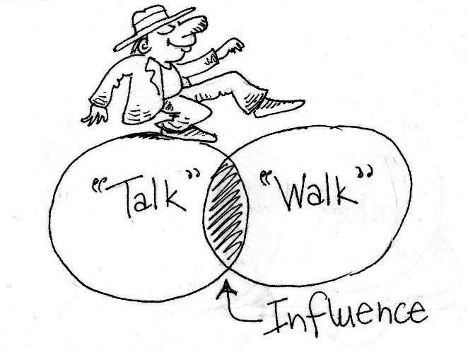
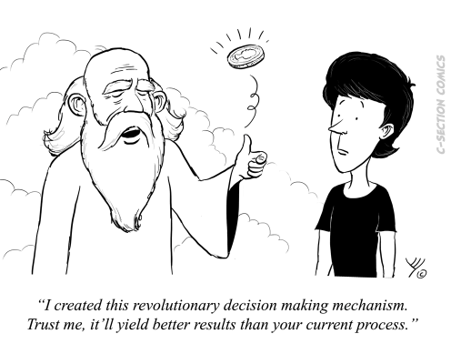
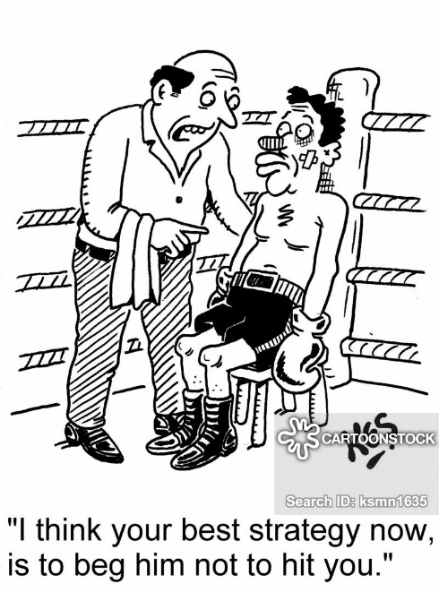

Power and influence of people in strategic decision making
==========================================================

Introduction
------------

[^1]*Power and influence*, the elixir that society has craved for throughout the
ages. Looking at human history one can draw a straight line through it by
following the people or entities who have wielded power and influence. They were
the history makers; they were the ones that shaped society and defined the
underlying narrative on which modern society is based today. All the way from
Zeus, Ra, Moses, *Caesar*, Jesus, Napoleon through to Gandhi, Hitler, JFK and
Mother Terresa. We stand in awe of them as they reach into our hearts and minds.
Some inspire greatness, others fear and yet others leave us speechless –
especially, every time Donald Trump[^2] tells the world about his “excellent
letter” he wrote to Kim Jong-Un (NCAN, 2019). These individuals and entities
stand as sentinels in the hallowed halls of history, reminding us that this
secret elixir called *power and influence* is the true key to achieving great
things. But things are changing at a rapid pace because, with the advent of big
data and *Machiavellian* amounts of processing power arose a new *fandangle* kid
- Artificial Intelligence. We are staring into the very likely possibility that
decision making will eventually be solely done by AI agents (Sincavage, 2017).
The burning question that arises is - *how will people’s power and influence and
their ability to make strategic decisions be affected by the advent of AI?* Will
we embrace it? Or, will we resist it? (Hughes, 2018)

[^1]: Picture creds – Asterix - Uderzo and Gozini

[^2]: As much as the author loathes Donald Trump, he admits throwing popcorn,
with childish excitement, at the TV each time DT yelled to an apprentice
executive, “You’re fired!”

In order to answer those questions, the author argues, that we only really need
to understand *homo sapiens* and how *power, influence and decision-making*
presents in this species. We know by now that *machines* can, without showing
fatigue, make faster and more accurate decisions than humans. That poses a
threat as well as an opportunity to humanity and if history has taught us
anything, then we’ll know that humans are reactive to both opportunities and
threats. But even more, in our modern day and age, how humans can turn threats
into opportunity and vice-a-versa.

The following literature review explores the dynamics between *power, influence
and the art of strategic decision making* in humans as it takes into
consideration various sources of literature, which range from books, online as
well as published articles and blogs that were written and published during the
last decade. This review will then frame that understanding in the context of an
immediate future in which AI decision making has already arrived.

**Power -** *“the capacity or ability to direct or influence the behaviour of
others or the course of events.”*

[^3]There is a saying that goes, “*Power corrupts; absolute power corrupts
absolutely*” - what a wonderful thought. How many times have Hollywood explained
to us in excruciating detail how the villain in the story implodes and destroys
him/herself in the final battle with the hero? If we rewind each of those movies
to the beginning, we find that our villain’s journey started the first time
he/she was beaten up on the kindergarten playground, teased about an incredible
acne outbreak or a dog that died. At that point vengeance was sworn. And we all
know that vengeance without power is nothing more than a hissy fit (Seltzer,
2011). And so, the pursuit of power begins.

[^3]: Our villain – Picture Creds - General

We’ll never really know if a person with the word “Chief” in his/her title in
the corporate world went through a similar journey in order to claim a position
of power and influence. But, yet, influential, literary entities such as the
Harvard Business Review has printed their presses dry to come to grips with what
real power is in the corporate context. Any search containing the word “power”
on HBR’s website will result in numerous published articles by renowned industry
leaders.

The aptly titled business blog,
[www.businessballs.com](http://www.businessballs.com), lists five types of
leadership powers that were coined by John French and Bertram Raven in 1959.
French and Raven labelled these types of power as *Legitimate* power, *Reward*
power, *Coercive* power, *Referent* power and *Expert* power (“French and
Raven’s bases of power,” 2019). Knowing the different types of power that are
exercised by people in organizations gives us a better understanding of the
power landscape. Power can’t exist in a vacuum; it needs oxygen from which it
can be ignited and launched. Leaders that apply any number of French and Raven’s
five types of power also have specific leadership styles. Although they exert
power in a specific way, they also lead in a specific way.

The Polish born psychologist, Kurt Lewin, who during his studies at MIT
identified three types of *leadership* styles named, *Authoritarian*,
*Democratic* and *Laissez*-*faire* (“Kurt Lewin,” 2019). Any combination of the
five types of power and three leadership styles can present itself in a leader.
Non is necessarily better than the other, it all depends on the environment,
circumstances and context. Certain combinations work better for some
environments and then the same combination will underperform in another context
or environment (Harness, 2019).

But what motivates people to achieve power in an organisation, besides childhood
bullying, *Acne vulgaris* or the trauma associated with the loss of a pet
(Gäbler & Maercker, 2011)? David McClelland, in his 1961 book titled, The
Achieving Society, identified three motivators that he believed we all have: a
*need* for *achievement*, a *need* for *affiliation*, and a *need* for *power*
(McClelland, 2010). McClelland built upon the earlier work of our old friend
Abraham Maslow, who created the *theory of needs (a.k.a Maslow’s hierarchy of
needs – which forever will make us feel guilty when indulging in too much
sleeping, eating and sex-capades, because we can’t escape the bottom rung of his
insidious pyramid…)*, which he so eloquently described in his seminal 1943 paper
titled, “A Theory of Human Motivation” (Maslow, 1943).

At this point it is necessary to differentiate between leaders and managers.
Managers, in general, are more focused on the tactical aspects of business
(budgeting, reporting, managing projects, etc.) where leaders are more involved
and influential in the overarching vision and mission of an organisation
(Arruda, 2016). Leaders must model the way, challenge the process, enable others
and inspire a shared vision. The underlying mechanisms of power and
leadership/management styles are the same for both these figures. At the end of
the day they adhere to and utilize the same driving forces, which enables them
to lead and manage.

**Influence – “***the capacity to have an effect on the character, development, or behaviour of someone or something, or the effect itself.”*
---------------------------------------------------------------------------------------------------------------------------------------------

[^4]

[^4]: Walk the Talk – Picture Creds - General

Influence, however, does not stand alone. It has a counterpart called
*persuasion* and the two work together in mysterious ways (Morgan, Cialdini, &
Hill, 2012). Any leader with any mixture of power and leadership styles have in
some measure the ability to influence and/or persuade people, events or
outcomes. I’ll venture as far as saying that *influence* and *persuasion* are
the main instruments that a leader must effectively wield in his/her daily reign
of their domain. For it is through *influence* and *persuasion* that they exert
*power* (Medium, 2019).

**Decision making – “***the act or process of discerning options and choosing a subset or a single one.”*
---------------------------------------------------------------------------------------------------------

Same as with *power*, *influence* and *persuasion,* does not exist in a vacuum.
The oxygen that fuels them is the *ability to make decisions*. Leaders are faced
with copious amounts of information daily and therefore need to be able to
discern what information is of value and then decide which of the available
options, as presented by the data, are important to pursuit.

[^5]Decision making is an art, which requires an array of abilities. One can
step back and start off with the highly abstracted question, *“How do we decide
to decide?”* Understanding the process by which individuals makes decision are
as important as the various factors that influence decision making (Dietrich,
2010). Contemporary decision analysis has identified several abstract dimensions
along which decision processes can be measured and guided (Neal & Spetzler,
2015). Those same dimensions are now challenged and disrupted by the way data is
starting to drive decisions in organizations (Vermeulen, 2014). As a driving
factor, data has become the central point of decision making (Singh, 2018).
Decision making heuristics such as availability, representativeness and affect,
can lead to cognitive biases and render decision making processes less effective
(Cherry, 2019).

[^5]: God flipping the coin – Picture Creds - General

[^6]**Strategic** - *adjective* – “*relating to the identification of long-term
or overall aims and interests and the means of achieving them*”.

[^6]: Boxer – Picture Creds - General

A course of action shapes the strategy wherein an individual or organization
anticipates the opponent’s moves as well as its own, and in effectively choosing
amongst the various options that presents, steers towards an anticipated outcome
(Decker, 2010).

Strategy, per definition, has everything to do with the long-term survival idea
and in business it is no different. Whether the strategy is to focus on
differentiation (Kokemuller, 2019), acquisition (Picincu, 2018) or growth, they
all have one thing in common – survival.

**Putting it all together**

Let’s consider a use case. An executive is facing a tough strategic decision but
has to her disposal the input of an AI entity, which has the capability to
process vast quantities of data inside and outside of the organization and
present the most logical and rational decision possible for the current context
and situation. What would the effect of such an aid be on our executive? Will
the executive see the AI’s superior decision making as a threat? Will our
executive feel unwanted, untrusted or even un-appreciated due to the AI’s
perfect input? Or, will our executive “high-jack” the AI’s decisions and start
moulding them towards a specific pre-conceived outcome? Or, will our executive
embrace the AI’s input and together with it drive even further the envelope of
strategic decision analysis?

It boils down to a one-sided issue to contemplate – how will the *human* react
to inclusion of AI in the decision space? Again, if history has taught us
anything, then it is that human decision-making strategies is not one of
unalloyed progress toward perfect rationalism. In fact, over the year’s humans
have steadily been coming to terms with constraints, both contextual and
psychological, on our ability to make optimal choices. Erroneous framing,
bounded awareness, excessive optimism - the debunking of Descartes’s rational
man threatens to swamp our confidence in our choices, with only improved
technology acting as a kind of empirical breakwater (Buchanan & O’Connell,
2006). Ouch! That latter statement strongly suggests that our use case executive
will at some stage face the situation where her decisions are governed, tempered
and shaped by the AI.

**Conclusion**

Looking back onto our brief investigation of *power, influence*, *strategy* and
*decision making,* one can only marvel at how intricate and complex the decision
environment can be. We can find an endless number of permutations amongst
individuals based on power drivers and leadership styles all mixed up into a
cauldron of personalities, beliefs, ideas, context and agendas. Whether that
latter concoction of entities produces individuals with Vulcan-like rationalism
or *Dopamine* crazed decision orgies is and will be always a bit unclear.
Looking at it all from that perspective I feel inclined to suggest that our use
case executive will eventually be pushed into a dark dusty corner of the
decision space.

It might sound unfair to pair our use case executive against AI. Decisions are
usually made by group consensus. To be fair, a discussion regarding *power,
influence* and *strategic decision making* cannot be viewed from only the
individual’s point of view. Such a study can gleam insights into the underlying
mechanisms of human decision making but, the narrative must be extended towards
the group as well. For this, the author suggests a further study into the
dynamics of group decision making.

REFERENCES
==========

Arruda, W. (2016). 9 Differences Between Being A Leader And A Manager. Retrieved
July 13, 2019, from
https://www.forbes.com/sites/williamarruda/2016/11/15/9-differences-between-being-a-leader-and-a-manager/\#51597d824609

Buchanan, L., & O’Connell, A. (2006, January 1). A Brief History of Decision
Making. *Harvard Business Review*, (January 2006). Retrieved from
https://hbr.org/2006/01/a-brief-history-of-decision-making

Cherry, K. (2019). How Heuristics Help You Make Quick Decisions or Biases.
Retrieved July 13, 2019, from Verywell Mind website:
https://www.verywellmind.com/what-is-a-heuristic-2795235

Decker, D. (2010). The Ability to Anticipate: A Secret Weapon for Strategic
Thinking and Influence DANIEL DECKER. Retrieved August 14, 2019, from DANIEL
DECKER website:
http://www.danieldecker.net/the-ability-to-anticipate-a-secret-weapon-for-strategic-thinking-and-influence/

Dietrich, C. (2010). Decision Making: Factors that Influence Decision Making,
Heuristics Used, and Decision Outcomes. *Inquiries Journal*, *2*(02). Retrieved
from
http://www.inquiriesjournal.com/articles/180/decision-making-factors-that-influence-decision-making-heuristics-used-and-decision-outcomes

Gäbler, I., & Maercker, A. (2011). Revenge after trauma: Theoretical outline. In
M. Linden & A. Maercker (Eds.), *Embitterment: Societal, psychological, and
clinical perspectives* (pp. 42–69). https://doi.org/10.1007/978-3-211-99741-3_5

Harness, R. (2019). Is There a Perfect Leadership Style? Retrieved July 13,
2019, from
http://www.leadershipchallenge.com/educators-section-resources-detail/is-there-a-perfect-leadership-style.aspx

Hughes, M. (2018). Do Or Die: Why Industry Must Embrace AI. Retrieved August 5,
2019, from Forbes website:
https://www.forbes.com/sites/mikehughes1/2018/11/28/do-or-die-why-industry-must-embrace-ai/

Kurt Lewin. (2019). In *Wikipedia*. Retrieved from
https://en.wikipedia.org/w/index.php?title=Kurt_Lewin&oldid=896945198

Maslow, A. H. (1943). A theory of human motivation. *Psychological Review*,
*50*(4), 370–396. https://doi.org/10.1037/h0054346

McClelland, D. C. (2010). *The Achieving Society*. Martino Publishing: Martino
Fine Books.

Medium. (2019). The 6 Principles of Persuasion by Dr. Robert Cialdini [Official
Site]. Retrieved August 14, 2019, from INFLUENCE AT WORK website:
https://www.influenceatwork.com/principles-of-persuasion/

Morgan, N., Cialdini, R. B., & Hill, L. A. (2012). Influence and Persuasion (HBR
Emotional Intelligence Series). Retrieved July 13, 2019, from
https://hbr.org/product/influence-and-persuasion-hbr-emotional-intelligence-series/10165-PBK-ENG

NCAN. (2019, June 23). Trump’s ‘excellent’ letter to Kim. Retrieved July 10,
2019, from NewsComAu website:
https://www.news.com.au/world/north-america/donald-trump-sent-an-excellent-letter-to-kim-jongun/news-story/0916bf94ebac80501f46b1d3dcce15ec\#.6jiiv

Neal, L., & Spetzler, C. (2015, May 27). An Organization-Wide Approach to Good
Decision Making. *Harvard Business Review*. Retrieved from
https://hbr.org/2015/05/an-organization-wide-approach-to-good-decision-making

Picincu, A. (2018). What Are the Different Types of Strategies in Business?
Retrieved July 13, 2019, from Bizfluent website:
https://bizfluent.com/list-6603373-different-types-strategies-business-.html

Seltzer, L. (2011). The Paradox of Anger: Strength or Weakness? Retrieved August
14, 2019, from Psychology Today website:
http://www.psychologytoday.com/blog/evolution-the-self/201106/the-paradox-anger-strength-or-weakness

Sincavage, D. (2017, August 16). How Artificial Intelligence will Change
Decision-Making for Businesses. Retrieved August 5, 2019, from Tenfold website:
https://www.tenfold.com/business/artificial-intelligence-business-decisions

Singh, H. (2018, December 1). Using Analytics for Better Decision-Making—Towards
Data Science. Retrieved July 13, 2019, from Medium website:
https://towardsdatascience.com/using-analytics-for-better-decision-making-ce4f92c4a025

Vermeulen, F. (2014, January 15). Take the Bias Out of Strategy Decisions.
*Harvard Business Review*. Retrieved from
https://hbr.org/2014/01/take-the-bias-out-of-strategy-decisions
