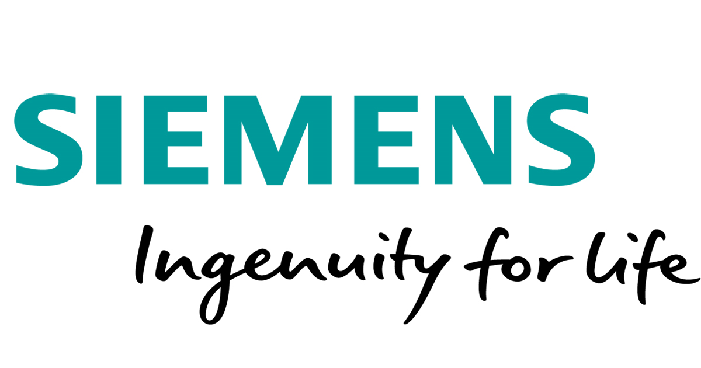
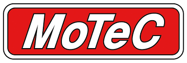
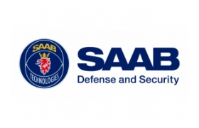

<!-- Experience -->
<h1 class="section-title">Experience</h1>

    

    <h3>Senior Software Engineer</h3>
	<h4>Siemens, Australia</h4>
    
May 2010 - May 2017

    

	Melbourne Metro Train Control System - 
	I was initially appointed as an integration engineer on the Core TCMS project, 
	which involved the creation of a control system for the Melbourne metropolitan rail system. 
	At that stage Public Transport Victoria (PTV) was having a second go at the system after the initial contractor, 
	Bombardier’s, offering was rejected (four year’s effort and a lot of money down the drain). 
	The integration team had the task of building the system from numerous applications developed in-house. 
	I had the opportunity to work on the early functionality of automating the build and roll-out process. 
	This task involved dev-ops work where you had to get your hands dirty in a lot of Linux bash scripting. 
	After two rounds of re-structuring I was moved onto the Verification and Validation team (V&V), 
	where I had the privilege to write a copious number of test documents (not that much fun). 
	However, it gave me a thorough understanding of the system and it assisted me in executing various systems tests, 
	which was required to get the system to higher operational levels. 
	After another couple of re-structuring moves (yes, this project was under pressure from day one and no, 
	it did not turn a profit – at least not at that stage), 
	I took over responsibility for the further development of two major sub systems on the project – 
	Electronic Docking Sheet (EDS) and the Electronic Train Graph (ETG). At that stage both the 
	products were fairly mature and consisted of a code base around 200,000 lines of code. 
	Both the applications were GUI based and was coded in C++. The STL 
	(Standard Template Library), Qt and several inhouse libraries were used to develop these applications. 
	Both applications relied heavily on design patterns architecture (the gang of four). 
	After seven year on the Core TCMS project, I decided to call it quits and pursue my own 
	little start-up company - ADSR Technologies. 
	

    

    <h3>Co-founder and BI Lead</h3>
    <h4>ADSR Technologies, Australia</h4>	
    
Jun 2017 - Dec 2018

    

		Towards the end of my career at Siemens I met <a href="https://www.linkedin.com/in/jon-heap-a61500a6/?originalSubdomain=au">Jon Heap</a> 
		who was a semi-retired dealer principle whos last 
		stint was at a Toyota dealership situated in the east of Melbourne. Together we started developing a cloud-based
		CRM/Sales Reporting system, AutoSalesReports (ASR), which was focused on the day-to-day running and management of
		an average Australian dealership. The development of ASR initiated under some heavy time and financial constraints.
		Jon and I hammered out the requirements for the system, which were based on his experience in managing dealerships. 
		I took it upon myself to code the system and Jon switched into a testing and training role. Initially, we set out to 
		create a proof-of-concept system and then flesh it out to a production system. As a development platform I chose Caspio 
		as it was geared for creating cloud-based databases and was oozing with functionality that assists in creating forms, 
		tables, charts, graphics, etc. that can be easily deployed as asp object. Our main philosophy was to ”fail-fast” –
		meaning that due to the time and financial constraints we had, we needed to get it to work quickly or else kill off the project. 
		I spent a solid year and a half coding ASR (while commuting on the train, weekends, after hours and lunch breaks at work)
		and learned a lot regarding creating websites. I’m still no guru when it comes to web design, but I know enough HTML,
		CSS and Java script to be able to achieve something. The webpages for ASR were hosted on GoDaddy and Caspio would serve
		the asp content from within the Caspio platform. 
		We caught a lucky break early on by meeting a cash laced investor who at that stage wanting to build
		his own auto holding group (multiple dealerships under one name). We successfully pitched ASR to him, 
		and he liked what he saw – mainly because ASR had the capability to present a snap shot views of all his
		dealership’s daily, weekly, monthly, etc. dealings. ASR could show him immediately which dealerships were under
		performing, for instance. We successfully rolled out ASR in nine of his dealerships and were giving daily training 
		sessions across Melbourne. Along side the roll-outs and personnel training we incorporated some additional requests 
		from the dealerships and also transformed some of the higher-level reporting pages into Mandarin. 
		Then, disaster struck. Our Chinese overlord were caught out for breaking the law regarding interstate
		wholesale transactions. The agreements he had with the different vehicle franchises came crashing down
		and one-by-one all his dealerships were sold over to new investors. Along with each new investor taking 
		over a dealership came new systems, new management and personnel and hence, ASR would be replaced with something else. 
		At that stage Jon and I realized we had a good run and decided to call it quits. We closed the company 
		and I decided to go back to Uni to study data science and Jon is sailing his boat somewhere in the Pacific Ocean.
	

    

    <h3>Software Engineer</h3>
    <h4>MoTeC, Australia</h4>	
    
Aug 2008 - May 2010

    

		After arriving in Australia in 2008, I landed my first job with MoTeC as a software engineer. 
		MoTeC is a small boutique engineering firm that develops products for the motor racing industry. 
		MoTeC’s software engineering department was driven by a small number of hard-core software developers, 
		which took exceptional pride in their work and became easily emotional/defensive when you accidentally 
		found a bug in their code. Non the less, their work ethic was second to none. 
		I was given the initial task of developing the software for a small sensor that was fitted on the 
		exhaust of a vehicle where it monitored the air-fuel mixture – it was call the LTC (Lambda-To-CAN). 
		I took up the task with excitement and vigour and as any good software engineer 
		(especially those that worked on military projects and is trained to work according to certain 
		software development guidelines), I started doing requirement gathering and analysis. 
		My first deliverable that I planned was an SRS (Software Requirement Specification). 
		However, after a week, I sensed that my colleagues were showing signs of distress and 
		were asking more and more when they could see some code. I re-assured them that I was on the 
		verge of publishing my newly written SRS and was putting the final touches on it. 
		To say the least, my colleagues were not impressed with the SRS and the reason being 
		is that it was not code. Later, one of the senior engineers told me straight – 
		“the code is the documentation”. It was then that I realised that the practice of 
		Systems Engineering is null and void in MoTeC (today, it might be different, but back in 
		2008, not so much). Fair enough, in an industry where there are no real safety regulations 
		(as compared to the aviation industry), then yes, writing documentation is properly a waist 
		of time and it is rather all about turn around time and pushing as much functionality into 
		your software as humanly possible. I will be forever be thankful for MoTeC giving me my first 
		job in Australia. But, after just under two years, and successfully delivering the LTC and 
		maintaining a few other products, I decided to seek a more structured and regulated environment. 
	

    

    <h3>Co-founder and BI Lead</h3>
    <h4>SAAB Avitronics, South Africa</h4>	
    
Jan 2002 - Feb 2008

    

		SAAB Avitronics is a military manufacturing company that operates in South Africa in close conjunction with the SANDF 
		(South African National Defence Force) and the country’s largest military manufacturer, Denel. At the time I was appointed
		as a senior software engineer, SAAB was awarded a contract with the Indian Airforce who purchased 240 Sukhoi-SU30 Russian
		fighter aircraft. SAAB won the contract to develop the crash recorders (black boxes, which incidentally is not black but,
		bright orange) as well as data acquisition units (DAU). The DAU flies alongside the crash recorder on the aircraft and has
		the capability to record any signal on the ARINC and MIL-1553 busses of the aircraft. My responsibility was to design, code,
		test and qualify the Flight Line System (FLS). The FLS was responsible for capturing flight data, uploading configuration data
		and performing live streaming of aircraft telemetry. It is during this time that I was exposed to MIL-STD-498 as well as 
		RTCA DO-178B - Software Considerations in Airborne Systems and Equipment Certification, which is a guideline dealing with 
		the safety of safety-critical software used in certain airborne systems. Both these standards, especially MIL-STD-498 gave
		me a thorough grounding in understanding and applying a proper SDLC. These days Agile, Scrum, Lean, Kaban, Extreme Programming etc.
		seem to be in demand. And, don’t get me wrong there is definitely a place for those methodologies. I think I was fortunate to 
		land on a project that exposed me to both MIL-STD-498 and DO-178B. After the Sukhoi project I worked on the Redhawk Attack Helicopter’s
		DAU code and kept up support and implemented smaller enhancements for the South African, British, Canadian, Australian and Indian 
		Airforces’ FLS systems which flies on their respective Lead-In-Fighter-Trainers (LIFT). After six years at SAAB I resigned,
		and my family and I decided to immigrate to Australia.
	

